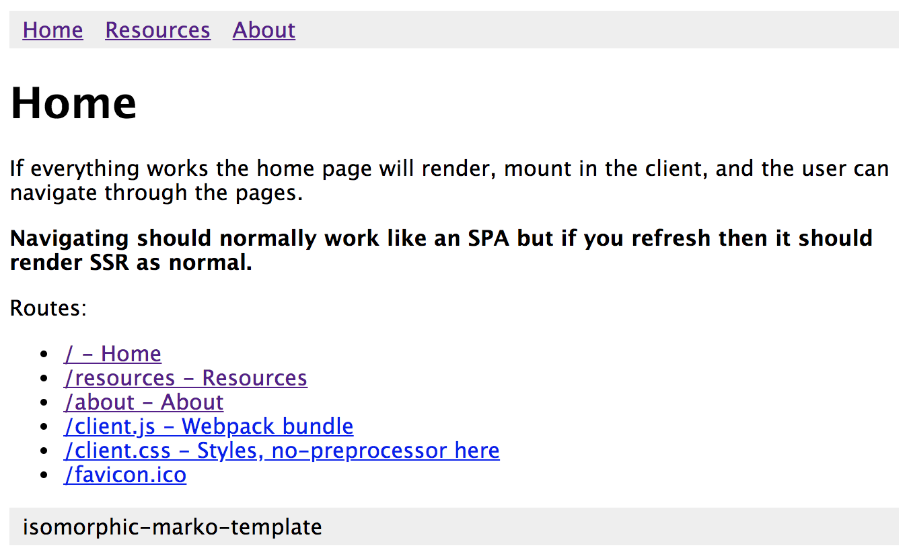

# isomorphic-marko-template

This is a dual-purpose repository for testing ideas with the [marko language](https://markojs.com).

+ Starter template for your project
+ Demonstrating a bug
+ Render via SSR
+ Also navigate like an SPA with html5 push navigation
+ User session with [cookie-session](https://github.com/expressjs/cookie-session#readme). To use set `req.session.loggedIn = true` or whatever you need.

## Development

Environment variables:

+ `HOST` the ip to bind to, defaults to `127.0.0.1`
+ `PORT` the port to bind to, defaults to `7162`
+ `COOKIE_SECRET` the secret for `cookie-session` middleware

```sh
# setup
git clone https://github.com/tcrowe/isomorphic-marko-template.git
cd isomorphic-marko-template
npm install

# run the server
# it will not automatically open but you can open http://127.0.0.1:7162
npm run dev
open http://127.0.0.1:7162

# other scripts
npm run clean
npm run prd
```

## Example

It looks like this when you load it.



## Copying, license, and contributing

Copyright (C) Tony Crowe <github@tonycrowe.com> (https://tcrowe.github.io) 2018

Thank you for using and contributing to make isomorphic-marko-template better.

⚠️ Please run `npm run prd` before submitting a patch.

⚖️ isomorphic-marko-template is Free Software protected by the GPL 3.0 license. See [./COPYING](./COPYING) for more information. (free as in freedom)
